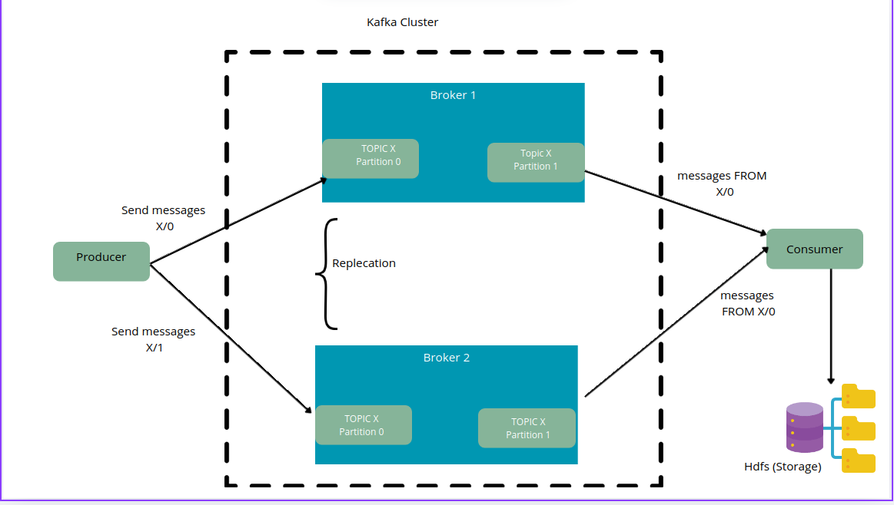

###### Kafka Data Ingestion Mini-Project - FinanceLake

This mini-project demonstrates a simple **data ingestion pipeline** using **Apache Kafka** to stream financial transactions into the FinanceLake ecosystem.

## Objective

To showcase how Apache Kafka can be used to ingest real-time financial data (CSV-based) and stream it into FinanceLake.

##  Architecture

- Kafka is **scalable**, **reactive**, and **event-driven**.
- Kafka integrates easily with tools like **Apache Spark**, **NiFi**, or **HDFS**.
- It is more modern and actively maintained compared to **Sqoop**.

## Technologies Used

- Apache Kafka 4.0.0
- Python 3.12.3
- `kafka-python` library

##  Sample Dataset

The sample CSV dataset (`creditcard.csv`) is excluded from version control for simplicity.

To test the pipeline, you can download the dataset from Kaggle:

📥 [Download on Kaggle](https://www.kaggle.com/datasets/mlg-ulb/creditcardfraud)

Or via command line (requires [Kaggle CLI](https://github.com/Kaggle/kaggle-api)):

`kaggle datasets download -d mlg-ulb/creditcardfraud`
`unzip creditcardfraud.zip -d data/`

##  How to Run

### 1. Install Requirements

Make sure Kafka and Python are installed. Install the `kafka-python` library:

`pip install kafka-python`

2- Format the KRaft storage (only once)

`bin/kafka-storage.sh format -t $(bin/kafka-storage.sh random-uuid) -c config/kraft/server.properties`

3- start kafka-server

-terminale  1 

`bin/kafka-server-start.sh config/kraft/server.properties`

4- Create the Kafka topic

`bin/kafka-topics.sh --create --topic transactions --bootstrap-server localhost:9092 --partitions 1 --replication-factor 1`

###Create and activate a virtual environment:

`python3 -m venv .venv`
`source .venv/bin/activate`

5-Run your Python Kafka producer:
-terminale  2
`python3 producer.py`

6- Run your python Kafka Consumer:
-terminale  3
`python3 consumer.py`

7- start hdfs services

`start-dfs.sh`

8- create directory 

hdfs dfs -mkdir -p /user/your-username/finance-data
hdfs dfs -put /tmp/transactions.log /user/your-username/finance-data/

Notes

    Ensure Hadoop is correctly configured and start-dfs.sh runs without issues.

    Replace your-username with your actual HDFS username.