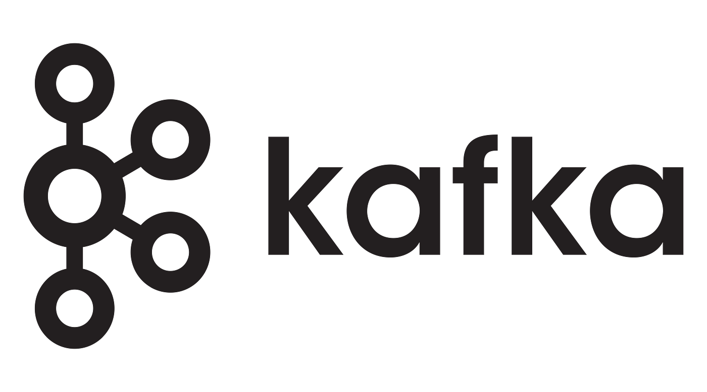
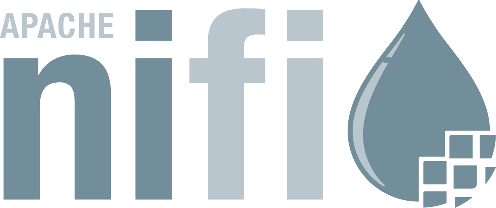
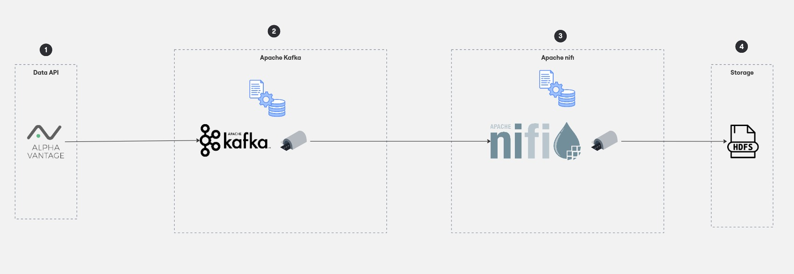
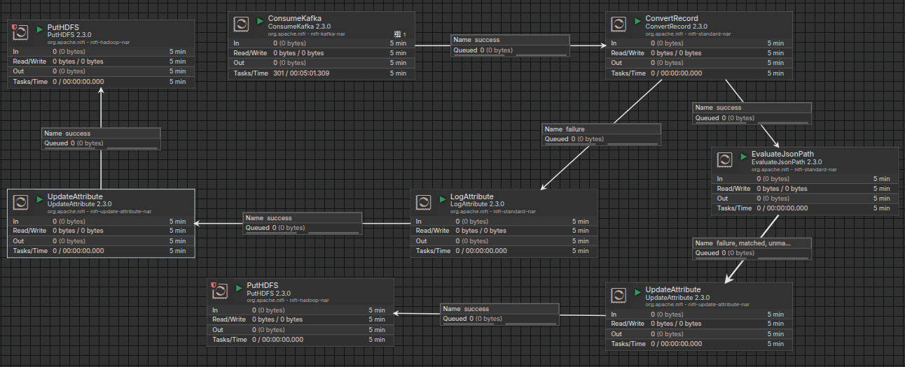
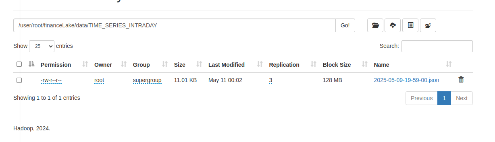
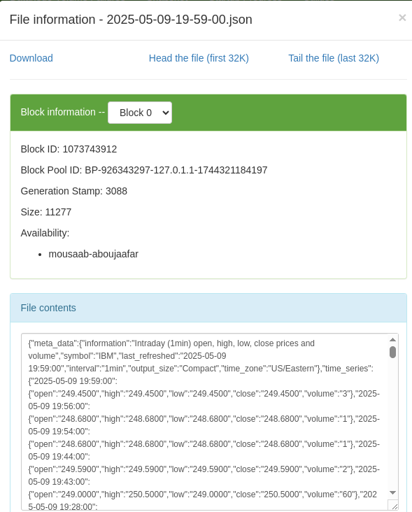
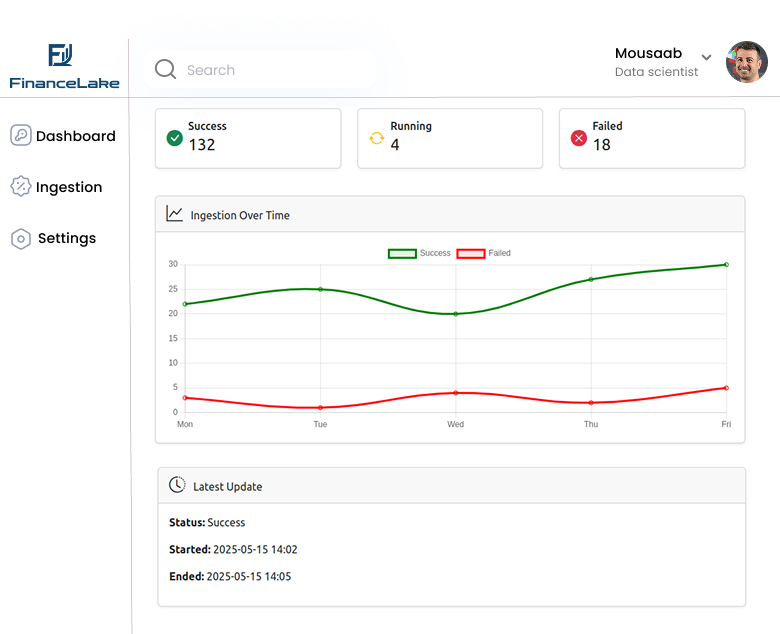

<br/>
<div style="display: flex; align-items: center; justify-content: center; background-color: white; padding: 10px; border-radius: 10px;">
  
  
  
</div>
<br/>

# FinanceLake Data Ingestion Process

## 📌 Overview

**Technologies Used:**

- Apache Kafka
- Apache NiFi
- Alpha Vantage API (for real-time stock data)

## 📈 Architecture



## 📈 Configuration et implémentation

### Environment Variables

   In the project root directory, create a `.env` file based on the `.env.example` file provided in the repository. This `.env` file contains sensitive and configuration-specific information like API key, directories, Topic.

   ```bash
   cp .env.example .env
   ```

### Apache Kafka: Using the Python Producer

We use a Python script to fetch data from Alpha Vantage and send it to a Kafka topic  

Ensure you have Python 3 installed, then install the required packages:

pip install dotenv kafka-python requests docopt hdfs

Copy the Producer Script 
Copy the content of the file kafka_producer_financeLake.py to your directory  

🔴⚠️  Create folder in Hdfs : hdfs dfs -mkdir -p /user/root/financeLake/logs/kafka/  

Start your Kafka server first, then run the Python script:

python3 kafka_producer_financeLake  py


### Apache Nifi :




ConsumeKafka – Reads stock data from a Kafka topic  

ConvertRecord – Converts incoming JSON data to a structured record  

EvaluateJsonPath – Extracts specific fields from the JSON  

UpdateAttribute – Adds metadata attributes  

PutHDFS – Saves the processed file to HDFS  

LogAttribute – Logs flowfile attributes for debugging  

  
##### Processor Configurations  
  
###### ConsumeKafka :  
  
Create service Kafka3ConnectionService :  
  
Bootstrap Servers => localhost:9092  
Security Protocol => PLAINTEXT  
SASL Mechanism => GSSAPI  
Kerberos User Service => No value set  
Kerberos Service Name => No value set  
SSL Context Service => No value set  
Transaction Isolation Level => Read Committed  
Max Poll Records => 10000  
Client Timeout => 60 sec  
Max Metadata Wait Time => 5 sec  
Acknowledgment Wait Time => 5 sec  
  
🔴⚠️  Enable service Kafka3ConnectionService  
  
Kafka Connection Service => Kafka3ConnectionService  
Group ID => financeLake-group  
Topic Format => names  
Topics => financeLake  
Auto Offset Reset => latest  
Commit Offsets => true  
Max Uncommitted Time => 1 sec  
Header Name Pattern => No value set  
Header Encoding => UTF-8  
Processing Strategy => FLOW_FILE  
  
  
###### ConvertRecord :  
  
Create service JsonTreeReader :  
  
Schema Access Strategy => Use 'Schema Text' Property  
Schema Text =>  
{ "type": "record", "name": "nifiRecord", "namespace": "org  apache  nifi", "fields": [ { "name": "meta_data", "type": [ "null", { "type": "record", "name": "MetaDataType", "fields": [ { "name": "information", "type": ["null", "string"] }, { "name": "symbol", "type": ["null", "string"] }, { "name": "last_refreshed", "type": ["null", "string"] }, { "name": "interval", "type": ["null", "string"] }, { "name": "output_size", "type": ["null", "string"] }, { "name": "time_zone", "type": ["null", "string"] } ] } ] }, { "name": "time_series", "type": [ "null", { "type": "map", "values": { "type": "record", "name": "TimeSeriesEntry", "fields": [ { "name": "open", "type": ["null", "string"] }, { "name": "high", "type": ["null", "string"] }, { "name": "low", "type": ["null", "string"] }, { "name": "close", "type": ["null", "string"] }, { "name": "volume", "type": ["null", "string"] } ] } } ] } ] }  
Starting Field Strategy =>Root Node  
Max String Length => 25 MB  
Allow Comments => false  
Date Format => No value set  
Time Format => No value set  
Timestamp Format => No value set  
  
Create service JsonRecordSetWriter :  
  
Schema Write Strategy => Do Not Write Schema  
Schema Cache => No value set  
Schema Access Strategy =>Use 'Schema Text' Property  
Schema Text =>  
{ "type": "record", "name": "nifiRecord", "namespace": "org  apache  nifi", "fields": [ { "name": "meta_data", "type": [ "null", { "type": "record", "name": "MetaDataType", "fields": [ { "name": "information", "type": ["null", "string"] }, { "name": "symbol", "type": ["null", "string"] }, { "name": "last_refreshed", "type": ["null", "string"] }, { "name": "interval", "type": ["null", "string"] }, { "name": "output_size", "type": ["null", "string"] }, { "name": "time_zone", "type": ["null", "string"] } ] } ] }, { "name": "time_series", "type": [ "null", { "type": "map", "values": { "type": "record", "name": "TimeSeriesEntry", "fields": [ { "name": "open", "type": ["null", "string"] }, { "name": "high", "type": ["null", "string"] }, { "name": "low", "type": ["null", "string"] }, { "name": "close", "type": ["null", "string"] }, { "name": "volume", "type": ["null", "string"] } ] } } ] } ] }  
Date Format => No value set  
Time Format => No value set  
Timestamp Format => No value set  
Pretty Print JSON => false  
Suppress Null Values => Never Suppress  
Allow Scientific Notation => false  
Output Grouping => One Line Per Object  
Compression Format => none  
  
🔴⚠️  Enable service JsonTreeReader & JsonRecordSetWriter  
  
Record Reader => JsonTreeReader  
Record Writer => JsonRecordSetWriter  
Include Zero Record FlowFiles => true  
  
  
###### EvaluateJsonPath :  
  
🔴⚠️  Add New field name it last_refreshed  
  
Destination => flowfile-attribute  
Return Type => auto-detect  
Path Not Found Behavior => ignore  
Null Value Representation => empty string  
Max String Length => 20 MB  
last_refreshed => $['meta_data']['last_refreshed']  
  
  
###### LogAttribute :  ConvertRecord --> LogAttribute  
  
Log Level => error  
Log Payload => false  
Attributes to Log =>No value set  
Attributes to Log by Regular Expression => *  
Attributes to Ignore => No value set  
Attributes to Ignore by Regular Expression => No value set  
Log FlowFile Properties => true  
Output Format => Line per Attribute  
Log prefix => No value set  
Character Set => UTF-8  
  
###### UpdateAttribute : LogAttribute --> UpdateAttribute  
  
🔴⚠️  Add New field name it filename  
  
Delete Attributes Expression => No value set  
Store State => Do not store state  
Stateful Variables Initial Value => No value set  
Cache Value Lookup Cache Size => 100  
`filename => ${now():format("yyyy-MM-dd-HH-mm-ss")}_${filename}`
  
###### PutHDFS : UpdateAttribute --> PutHDFS  
  
🔴⚠️  Create folder in Hdfs : hdfs dfs -mkdir -p /user/root/financeLake/logs/nifi/  
  
Hadoop Configuration Resources => /home/hadoop/hadoop/etc/hadoop/core-site.xml  
Kerberos User Service => No value set  
Additional Classpath Resources => No value set  
Directory => /user/root/financeLake/logs/nifi/  
Conflict Resolution Strategy => replace  
Writing Strategy => Write and rename  
Block Size => No value set  
IO Buffer Size => No value set  
Replication => 3  
Permissions umask => No value set  
Remote Owner => No value set  
Remote Group => No value set  
Compression codec => NONE  
Ignore Locality => false  
Resource Transfer Source => FlowFile Content  
  
  
###### UpdateAttribute : EvaluateJsonPath --> UpdateAttribute  
  
🔴⚠️  Add New field name it filename  
  
Delete Attributes Expression => No value set  
Store State => Do not store state  
Stateful Variables Initial Value => No value set  
Cache Value Lookup Cache Size => 100  
filename => ${last_refreshed:toDate("yyyy-MM-dd HH:mm:ss"):format("yyyy-MM-dd-HH-mm-ss"):append(".json")}  
  
  
###### PutHDFS : UpdateAttribute --> PutHDFS  
  
🔴⚠️  Create folder in Hdfs : hdfs dfs -mkdir -p /user/root/financeLake/data/TIME_SERIES_INTRADAY/  
  
Hadoop Configuration Resources => /home/hadoop/hadoop/etc/hadoop/core-site.xml  
Kerberos User Service => No value set  
Additional Classpath Resources => No value set  
Directory => /user/root/financeLake/data/TIME_SERIES_INTRADAY/  
Conflict Resolution Strategy => replace  
Writing Strategy => Write and rename  
Block Size => No value set  
IO Buffer Size => No value set  
Replication => 3  
Permissions umask => No value set  
Remote Owner => No value set  
Remote Group => No value set  
Compression codec => NONE  
Ignore Locality => false  
Resource Transfer Source => FlowFile Content  


## 📌 Result




<br>




## 📊 Dashboard

<br>



